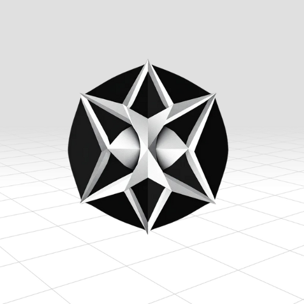

<div align="center">
  

  # Mutaspring Robotics - Research platform for AI robot experimentation

  <p>An experimental platform for training AI-powered robots using genetic algorithms and neural networks</p>
</div>

## Relevant Links

- $MUTA: YqemSkz87oeRfdoQ72bW2fcYtZGmTaVanMJMYNEpump
- Website: https://mutaspring.com
- Twitter: https://x.com/mutarobotics

## Features

- 🧬 Genetic algorithm-based learning
- 🧠 Neural network-driven robot control
- 🤖 Multiple robot instances running simultaneously
- 📊 Real-time performance visualization
- 🎮 Interactive camera controls
- 📈 Generation-by-generation learning progress tracking

## Tech Stack

### Frontend
- Three.js
- JavaScript/ES6
- Chart.js
- dat.GUI

### Backend
- Pure JavaScript implementation
- Custom neural network architecture
- Genetic algorithm implementation

## Getting Started

1. Clone the repository:

    ```console
    git clone https://github.com/javierthegreatt/mutaspring.git
    cd mutaspring
    ```

2. Open the project:

    ```console
    python -m http.server
    ```

    Or use any local development server of your choice.

3. Open your browser and navigate to:

    ```console
    http://localhost:8000
    ```

## Project Structure

- `/src` - Source code for the simulation
  - `main.js` - Main program entry point
  - `simulation.js` - Core simulation logic
  - `character.js` - Robot character controller
  - `ann.js` - Artificial neural network implementation
  - `gene.js` - Genetic algorithm implementation
  - `box.js` - Obstacle generation and management
  - `graph.js` - Performance visualization
- `/models` - 3D model assets
- `/include` - Additional resources and styles

## License

This project is licensed under the MIT License - see the LICENSE file for details.